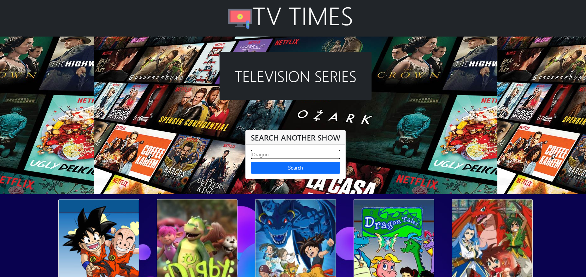
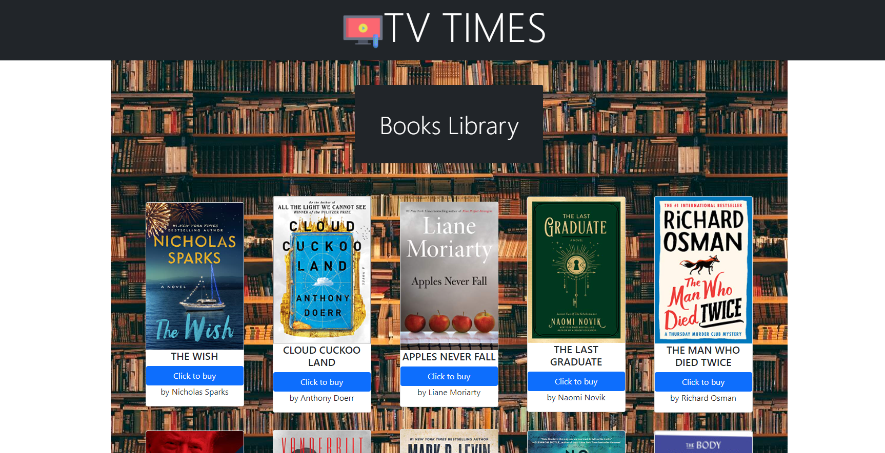
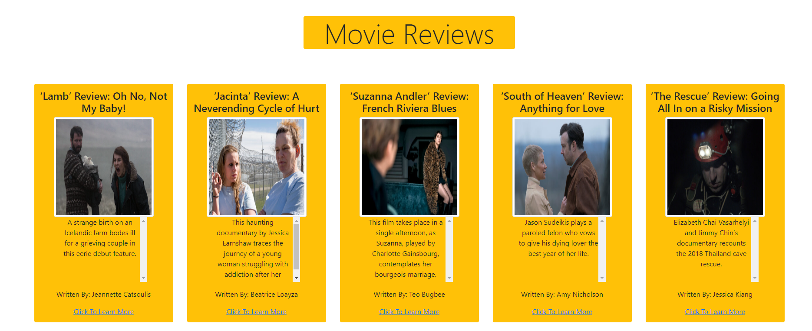

# Team-cara-dunes-TV-Times

Link to deployed app [https://sehaj97.github.io/Team-cara-dunes-TV-Times/](https://sehaj97.github.io/Team-cara-dunes-TV-Times/)

Demo Presentation Link [https://docs.google.com/presentation/d/1pQbs8JDigSjjgjYwfjWqyWk0_bUgmXXzL_BjZbYpvp8/edit?usp=sharing](https://docs.google.com/presentation/d/1pQbs8JDigSjjgjYwfjWqyWk0_bUgmXXzL_BjZbYpvp8/edit?usp=sharing)

## Description
YOUR ONE PLACE STOP TO GET UP TO DATE WITH WORLD.

TV Times is your handy web encyclopedia.

Technologies Used: html, css, js, bootstrap, jquery, github.

API’s Used: 

[Tv Maze show search API](https://www.tvmaze.com/api)

[Newyork Times Books API](https://developer.nytimes.com/docs/books-product/1/routes/lists/overview.json/get)

[Newyork Times Movie Reviews API](https://developer.nytimes.com/docs/movie-reviews-api/1/routes/reviews/search.json/get)

[Newyork Times Articles API](https://developer.nytimes.com/docs/articlesearch-product/1/routes/articlesearch.json/get)

Pages Build:

Home Page - Worked with team to create a page to access 4 apis on 4 different pages

Tv Series page - show the information on tv series/shows. have a search bar where you can search for any show/series.

Books page - show the information on books. kind of like a library but redirects you on which page you can buy the book.

Movie page - show reviews on movies. 

Article page -show news articles based on the search input keyword.

## Screenshots

### screenshot Home Page

### screenshot Tv series Page

### screenshot books page Page

### screenshot news article page Page

### screenshot movie reviews Page

